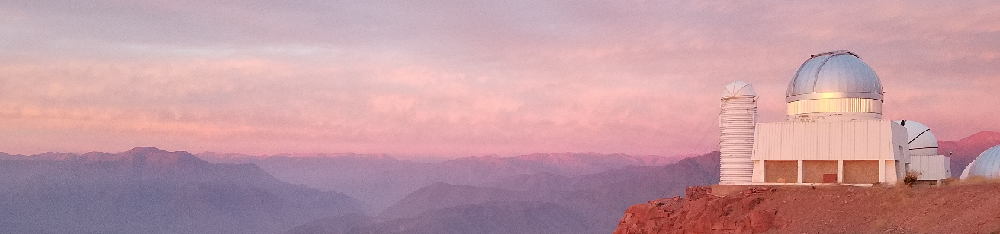

## welcome!

We are the team who facilitated the Astronomy Poverty Survey, released April--September 2024.  Our team is currently analyzing the results from the survey and plan to share the main results in a flagship white paper before the next Winter AAS (Jan 2026).

During this Winter's AAS, January 2025, we hosted a special session sharing the prelimiary results from the survey with the astronomy commnunity.  We will share the recording from that session and associated slides on this github organization.

Stay tuned for more updates! 🚀
